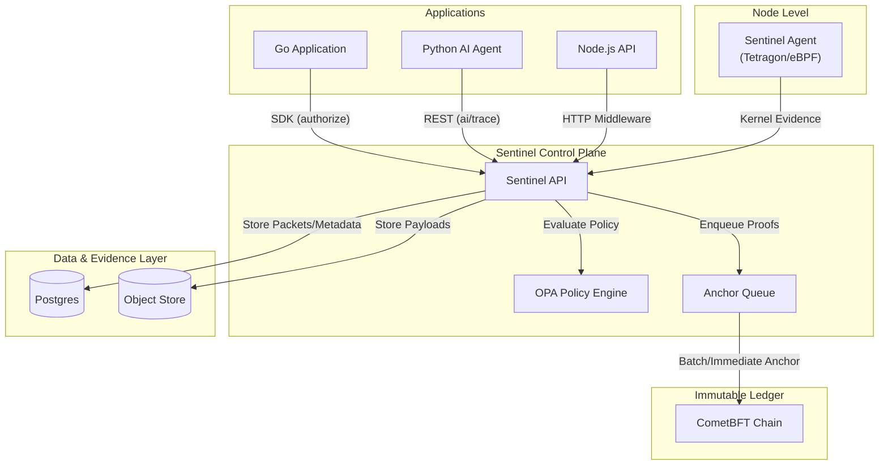
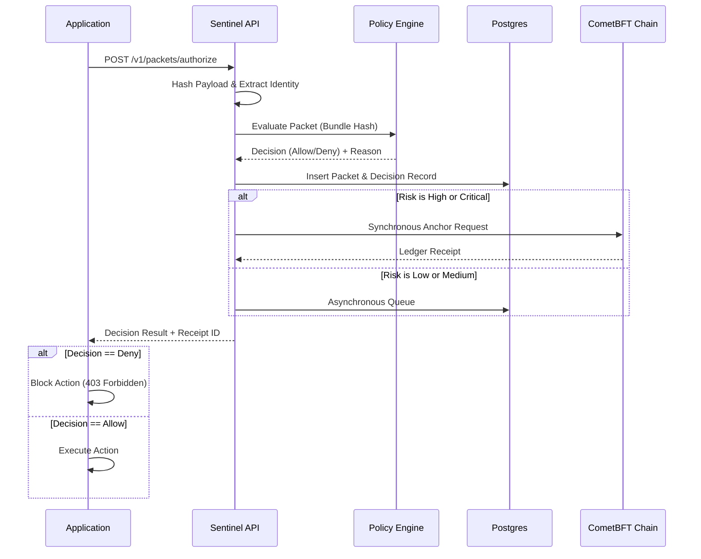
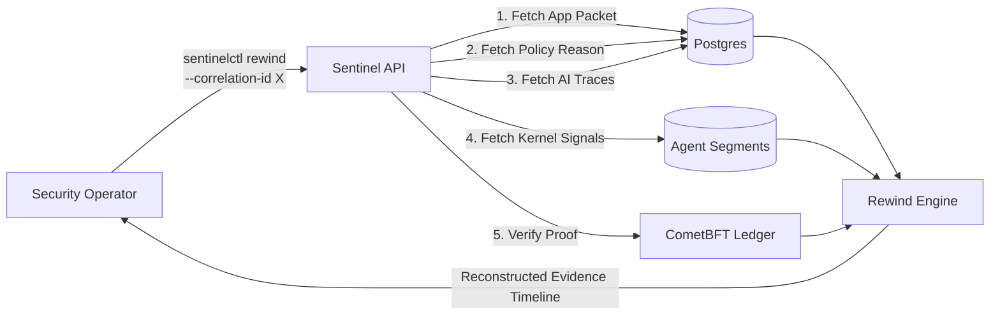

# Sentinel

**The Unified Governance Moat for Modern Apps.**

Sentinel is an open-source, fail-safe governance layer for your applications. Whether you're building a traditional REST API, an event-driven system, or the next generation of AI agents, Sentinel ensures that every critical action is policy-checked, audited, and mathematically anchored to a tamper-proof ledger.

No more scattering authorization checks, audit logs, and compliance mechanisms across dozens of microservices. Integrate Sentinel once, and govern your entire application portfolio from a single control plane.

## Why Sentinel?

When your application processes high-risk transactions—like issuing refunds, modifying user permissions, or executing agentic AI tool calls—you need absolute certainty about *who* did *what*, *why*, and *when*. 

Sentinel provides:

- **Unified Policy Enforcement**: Write policies once in Rego (OPA) and enforce them universally across your stack.
- **Immutable Evidence**: High-risk actions are automatically chained and anchored to a CometBFT ledger, making your operational history tamper-evident.
- **Native AI Governance**: Dedicated "AI Lanes" to trace prompt hashes, model choices, and tool invocations, ensuring your AI agents don't go rogue.
- **72-Hour Rewind Window**: Instantly reconstruct any incident or correlation ID with perfect clarity across application events, policy decisions, and runtime kernel evidence.
- **Developer-First Integration**: Drop-in SDKs, minimal overhead, and a "fail-open/fail-closed" mode strategy so you can start observing today and enforce tomorrow.

## Architecture

Sentinel runs as a decoupled control plane. It separates the application logic from governance, policy evaluation, and immutable storage.

### High-Level Component Topology



### Authorization Flow (Guard Mode)

When an application attempts a high-risk action, it consults Sentinel before proceeding. Sentinel evaluates the risk, checks the policy, stores the evidence, and anchors the proof to the ledger.



### Incident Rewind Flow

When investigating an incident, Sentinel correlates data across all persistence layers to reconstruct exactly what happened during the 72-hour operational window.



## Quick Integration

Integrating Sentinel is as simple as adding a middleware or making a single REST call before your high-risk operations.

### Go SDK Example
```go
import "github.com/your-org/sentinel/sdk/go/sentinel"

client := sentinel.NewClient(sentinel.Config{
    Endpoint: "http://sentinel-api:8080",
    AppID:    "billing-api",
    Mode:     sentinel.ModeGuard, 
})

// Wrap your critical endpoints with Sentinel Middleware
mux.Handle("/refund", client.HTTPMiddleware(
    sentinel.RoutePolicy{
        ActionName: "invoice.refund.create",
        Category:   "http",
        Risk:       "high",
        Mutating:   true,
    },
    refundHandler,
))
```

### Python / AI Integration Example (Claude/Anthropic)
Governing AI models requires knowing what prompt was sent and what tools were used. Sentinel handles this effortlessly:

```python
decision = sentinel_ai_authorize(
    model_id="claude-3-7-sonnet-20250219", 
    prompt_text=prompt, 
    correlation_id=corr_id
)

if decision.get("decision") == "deny":
    raise PermissionError("AI action prevented by Sentinel.")

# ... execute your Claude API call ...

sentinel_ai_result(
    packet_id=decision["packet_id"], 
    response_text=response_text, 
    tool_call_count=len(tools_used), 
    correlation_id=corr_id
)
```

## Getting Started

Ready to lock down your stack?

1. **Deploy Sentinel**: Run it locally using Docker Compose, or deploy to Kubernetes using our production-ready Helm charts.
2. **Register Your App**: Use `sentinelctl` to issue identity keys for your service.
3. **Integrate**: Drop the SDK into your Go app, Node.js API, or Python AI Agent.

Check out the [Installation Guide](./docs/runbooks/01-installation.md) and [Integration Runbook](./docs/runbooks/04-app-integration.md) to get started.

## Community & Support

Sentinel is built for developers who care about security, compliance, and sanity. Feel free to open issues, submit PRs, or check out our `/examples` folder for integrations with Go, Express, FastAPI, and Anthropic.
