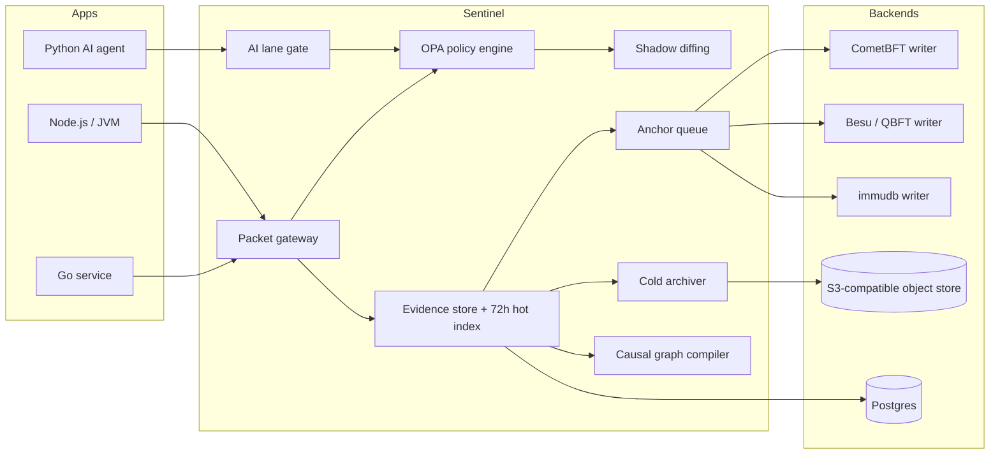
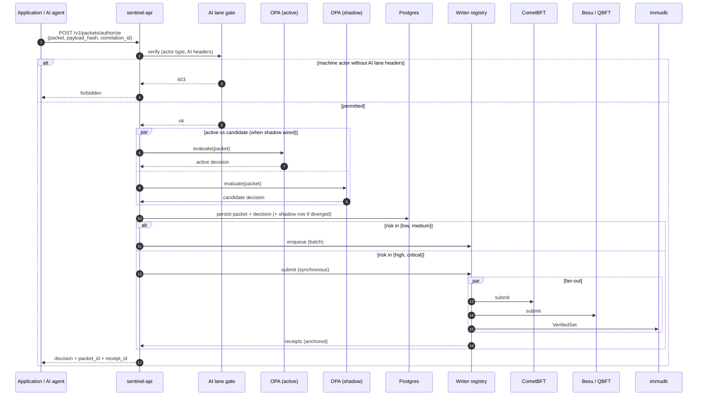
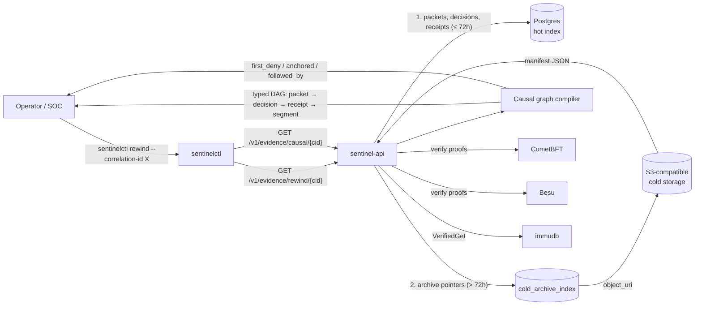

# Sentinel

<p align="center">
  
</p>

**Govern, audit, and replay every high-stakes action your services and
AI agents take — through one external service.**

When an action matters — a refund, a role change, an AI agent invoking a
tool that costs money or moves data — "the log says so" isn't good
enough. Teams end up reinventing the same three things in every
service: a hand-rolled policy check, an audit log nobody fully trusts,
and a panic-mode incident replay tool that nobody wrote until they
needed it. Sentinel is one external control plane that handles all
three. Point your apps and AI agents at it; the high-stakes actions
become governed, tamper-evident, and replayable for 72 hours, with a
durable cold archive after that.

## When you'd reach for it

- **Money movement.** Refunds, payouts, ledger writes. You need to
  prove who triggered what, against which policy, with a hash chain
  auditors and regulators can verify independently.
- **AI agent guardrails.** Your agent can call tools that move money,
  change data, or burn API budget. Sentinel sits in front of the model
  call, decides whether the action is allowed, and keeps a prompt /
  response / tool-call trace tied to a ledger receipt. Bypass attempts
  are rejected at the gateway.
- **Privileged platform actions.** Schema migrations, IAM changes,
  secret reads, Kubernetes deploys. One Rego bundle decides who can do
  what; one rewind query reconstructs the full event chain when
  something goes sideways.
- **Compliance-bound systems.** KYC, healthcare, government, anything
  with HIPAA / SOC 2 / PCI / GDPR pressure. The 72-hour hot index plus
  the immutable cold archive give you the evidence shape external
  auditors expect.
- **Multi-team platforms.** Instead of every service building its own
  audit / policy / anchor stack, they all speak to one Sentinel. The
  contract is a single canonical packet schema, with drop-in SDKs in
  Go, TypeScript, and Python.

Sentinel is *not* a SIEM, a general log aggregator, or an APM. It's the
layer that enforces and proves policy on a small set of high-stakes
actions; routine traffic should keep flowing through your existing
observability stack.



## What's in the repo

| Component | Path | What it does |
|---|---|---|
| `sentinel-api` | [cmd/sentinel-api](cmd/sentinel-api) | HTTP control plane — packets, AI lane, evidence, ledger, policy |
| `sentinel-agent` | [cmd/sentinel-agent](cmd/sentinel-agent) | Node-level evidence collector hook (Tetragon/eBPF integration point) |
| `sentinel-chain-app` | [cmd/sentinel-chain-app](cmd/sentinel-chain-app) | ABCI app for the bundled CometBFT chain |
| `sentinelctl` | [cmd/sentinelctl](cmd/sentinelctl) | Operator CLI: doctor, register, emit, simulate, verify, rewind, export, writers, shadow-divergences |
| Canonical packet | [internal/core](internal/core) | `sentinel.packet.v1` schema, decision and receipt types |
| OPA engine + shadow | [internal/policy](internal/policy) | Evaluate active bundle; concurrent shadow bundle; safe-promotion check |
| Multi-backend ledger | [internal/ledger](internal/ledger) | `Writer` registry plus real CometBFT JSON-RPC, real Besu JSON-RPC, and real immudb client backends |
| Evidence | [internal/evidence](internal/evidence) | 72h hot index, segments, rewind, retention, hot→cold archiver |
| Causal graph | [internal/causalgraph](internal/causalgraph) | DAG compiler over rewind output keyed by `correlation_id` |
| AI lane gate | [internal/capture/ai](internal/capture/ai) | Header contract: machine actors must transit the AI gateway |
| Postgres store | [internal/store/postgres](internal/store/postgres) | App registry, packets, decisions, receipts, segments, shadow log, cold archive index |
| Object store (S3) | [internal/store/object](internal/store/object) | MinIO/S3-compatible adapter for evidence payloads and archives |
| Go SDK | [sdk/go/sentinel](sdk/go/sentinel) | Drop-in Go middleware |
| TypeScript SDK | [sdk/ts](sdk/ts) | Strict-mode TS for Node 20+, Bun, Workers, Deno |
| Python SDK | [sdk/python](sdk/python) | Sync + async clients over httpx |
| OpenAPI spec | [contracts/openapi.yaml](contracts/openapi.yaml) | Authoritative API contract |
| Compose stack | [deploy/compose](deploy/compose) | Postgres, MinIO, OPA, OTel, CometBFT, sentinel-api/agent/chain-app |
| Helm chart | [deploy/helm/sentinel](deploy/helm/sentinel) | Production-ready chart skeleton |
| Sample policy | [policy/bundles/default](policy/bundles/default) | Default Rego bundle |

## Capabilities

- **Unified policy enforcement** in Rego/OPA, hot-reloaded from a bundle URL
- **Native AI governance** — model and tool calls go through a dedicated
  AI lane that requires the `X-Sentinel-AI-Route` and `X-Sentinel-AI-Actor`
  headers; bypass attempts are rejected with HTTP 403
- **Pluggable ledger** — the `Writer` registry holds CometBFT (default),
  Besu/QBFT (EVM contract anchoring), and immudb (verifiable proof) backends
  concurrently; `/v1/ledger/writers` exposes per-writer health
- **Shadow policy diffing** — every authorise call evaluates an active bundle
  and a candidate bundle in parallel; divergences land in `shadow_decisions`
  for safe promotion review
- **72-hour hot rewind window** — query packets, decisions, receipts, and
  evidence segments by `correlation_id`; older evidence is archived to S3 with
  a durable proof locator
- **Causal graph compiler** — `GET /v1/evidence/causal/{correlation_id}`
  returns a typed DAG with `first_deny`, `anchored`, `followed_by` edges
- **Receipt enrichments** — receipts carry `correlation_id`, `evidence_root_hash`,
  `writer_kind`, `writer_name` for KYB-style replay
- **Drop-in SDKs** for Go, TypeScript, and Python with HTTP middleware,
  AI lane helpers, rewind / causal graph access, and writer health

## Authorise flow

The synchronous decision path. Machine actors are caught by the AI gate
*before* policy runs; the active OPA bundle and (when wired) a candidate
shadow bundle evaluate concurrently; the writer registry fans the
compact proof out to every configured backend.



## Rewind & causal graph

Reconstructing what happened for one `correlation_id`. The hot index
serves the 72-hour operational window directly; older evidence is
served from the cold archive index, which points at the S3 manifest
written by the archiver. Either path feeds the causal graph compiler so
the operator UI sees a single typed DAG.



## Quickstart

### 1. Bring up the dev stack

```bash
make compose-up
```

This starts Postgres, MinIO, OPA, OTel Collector, CometBFT, the sentinel-api,
sentinel-agent, and sentinel-chain-app. Migrations under
[internal/store/migrations](internal/store/migrations) auto-apply on first run
because the Postgres container mounts the migrations directory at
`/docker-entrypoint-initdb.d`.

If you already have your own Postgres, run migrations directly:

```bash
SENTINEL_POSTGRES_DSN=postgres://… make migrate
```

### 2. Verify the control plane

```bash
make build
SENTINEL_API_ENDPOINT=http://localhost:8080 ./bin/sentinelctl doctor
```

You should see the four probes (`/healthz`, `/readyz`, `/v1/ledger/writers`,
`/v1/policy/bundles`) all pass.

### 3. Register an app and emit a test packet

```bash
./bin/sentinelctl register app \
  --app-id billing-api --service billing --env dev --owner platform --mode guard

./bin/sentinelctl emit-test-packet \
  --app-id billing-api --action invoice.refund.create --risk high --mutating
```

The response includes a `packet_id` and a provisional `receipt_id`. Use those
to walk the new endpoints:

```bash
./bin/sentinelctl verify-ledger --packet-id pkt_…
./bin/sentinelctl rewind --correlation-id corr_… --graph
./bin/sentinelctl writers
./bin/sentinelctl shadow-divergences --since 1h
```

### 4. Wire your application

**Go:**

```go
import "github.com/your-org/sentinel/sdk/go/sentinel"

client := sentinel.NewClient(sentinel.Config{
    Endpoint: "http://sentinel-api:8080",
    AppID:    "billing-api",
    Mode:     sentinel.ModeGuard,
})

mux.Handle("/refund", client.HTTPMiddleware(
    sentinel.RoutePolicy{
        ActionName: "invoice.refund.create",
        Category:   "http",
        Risk:       "high",
        Mutating:   true,
    },
    refundHandler,
))
```

**TypeScript:**

```ts
import { SentinelClient, withSentinel } from "@sentinel/sdk";

const sentinel = new SentinelClient({
  endpoint: "http://sentinel-api:8080",
  appId: "billing-api",
  mode: "guard",
});

app.post(
  "/refund",
  withSentinel(sentinel, {
    actionName: "invoice.refund.create",
    category: "http",
    risk: "high",
    mutating: true,
  }),
  refundHandler,
);
```

**Python:**

```python
from sentinel_sdk import SentinelClient, RoutePolicy, sha256_hash

with SentinelClient("http://sentinel-api:8080", "billing-api", mode="guard") as s:
    decision = s.authorize(
        correlation_id=s.new_correlation_id(),
        policy=RoutePolicy("invoice.refund.create", "http", "high", mutating=True),
        payload_hash=sha256_hash(request_body),
    )
    if decision.decision == "deny":
        raise PermissionError(decision.reason)
```

**AI lane (Python):**

```python
authz = s.ai_authorize(
    correlation_id=corr_id,
    model_id_hash=sha256_hash(model_id),
    prompt_hash=sha256_hash(prompt_text),
)
if authz.decision == "deny":
    raise PermissionError(authz.reason)
# … run the model call …
s.ai_result(corr_id, response_hash=sha256_hash(response_text), tool_call_count=n)
```

The TS and Python SDKs auto-attach the required `X-Sentinel-AI-Route` and
`X-Sentinel-AI-Actor` headers on AI lane calls.

## API surface

The full surface lives in [contracts/openapi.yaml](contracts/openapi.yaml).
The most useful endpoints in everyday use:

| Method | Path | What it does |
|---|---|---|
| POST | `/v1/apps/register` | Register an application |
| POST | `/v1/packets/authorize` | Synchronous decision for a high-risk action |
| POST | `/v1/packets` | Fire-and-forget packet ingest |
| POST | `/v1/ai/authorize` | AI lane authorise (machine actors only) |
| POST | `/v1/ai/result` | Record AI response hash and tool call count |
| GET | `/v1/evidence/rewind/{correlationId}` | Reconstruct evidence for a correlation |
| GET | `/v1/evidence/causal/{correlationId}` | Compiled causal DAG for a correlation |
| GET | `/v1/ledger/receipts/{packetId}` | Latest receipt for a packet |
| GET | `/v1/ledger/verify/{receiptId}` | Re-verify a receipt against the chain |
| GET | `/v1/ledger/writers` | Per-writer health snapshot |
| GET | `/v1/policy/bundles` | List policy bundle revisions |
| POST | `/v1/policy/simulate` | Preview a candidate bundle's decision |
| GET | `/v1/policy/shadow/divergences` | Recent shadow vs active divergences |
| GET | `/healthz`, `/readyz` | Liveness and readiness |

## Configuration

Service config is YAML; see [sentinel.dev.yaml](sentinel.dev.yaml) for a
working example. Postgres DSN and signing keys are loaded from mounted
secrets, never from environment variables in production.

Set per-process environment variables to override individual values:

| Variable | Purpose |
|---|---|
| `SENTINEL_CONFIG_FILE` | Path to YAML config |
| `SENTINEL_POSTGRES_DSN` | Postgres DSN (overrides secret file) |
| `SENTINEL_API_ENDPOINT` | Default endpoint for `sentinelctl` and SDKs |
| `SENTINEL_API_TOKEN` | Bearer token for `sentinelctl` and SDKs |

## Production wiring notes

- **CometBFT**: a real ed25519 signing key must be mounted; the backend
  uses `broadcast_tx_commit` and reads `/status` for height.
- **Besu/QBFT**: production must supply an `EVMSigner` that produces
  signed raw transactions (go-ethereum, an HSM, or a remote signer such as
  web3signer). The read paths (`eth_blockNumber`,
  `eth_getTransactionReceipt`) work without a signer.
- **immudb**: the backend uses `VerifiedSet`/`VerifiedGet`; an empty
  endpoint falls back to an in-memory shadow log for CI/dev only.
- **S3 / MinIO**: pass an `object.MinioConfig` with credentials and bucket
  to back the cold archiver. `evidence.NewObjectStoreSink` adapts the store
  to `evidence.ArchiveSink`.

## Repository layout

```
cmd/                Binaries
contracts/          OpenAPI + protobuf
deploy/             Compose, Helm, Kubernetes
docs/               Runbooks
examples/           Go, Node.js, Python, Anthropic, OpenAI-compatible AI lane
internal/           All internal packages (api, core, ledger, evidence, …)
policy/             OPA bundles
sdk/                Go, TypeScript, Python SDKs
```

## Contributing

See [CONTRIBUTING.md](CONTRIBUTING.md). Quick path:

```bash
make tidy && make build && make ci
```

`make ci` runs every gate locally — gofmt, vet, build, race tests,
TypeScript type-check, Python parse, and OpenAPI lint. The repo does
not use a hosted CI service. Update the OpenAPI spec
([contracts/openapi.yaml](contracts/openapi.yaml)) when the HTTP
surface changes.

## License

Apache License 2.0 — see [LICENSE](LICENSE).
