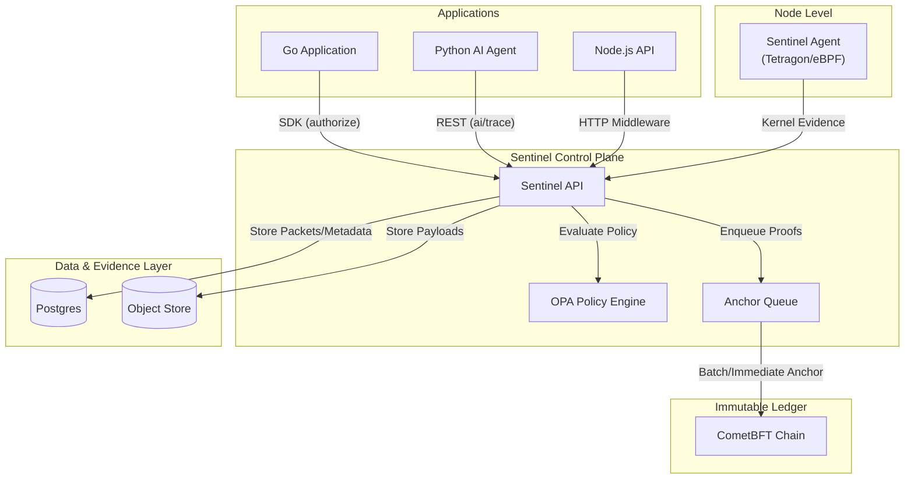
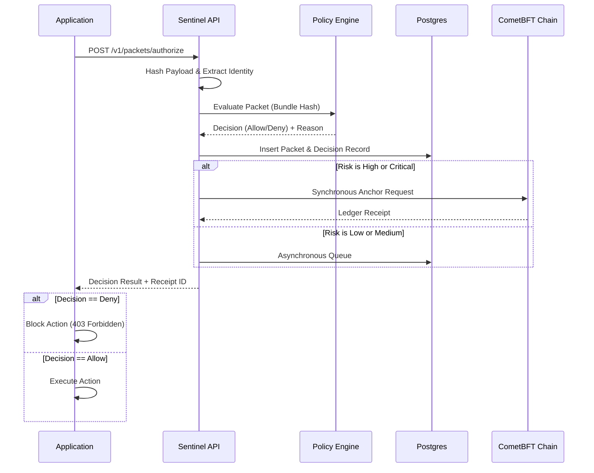
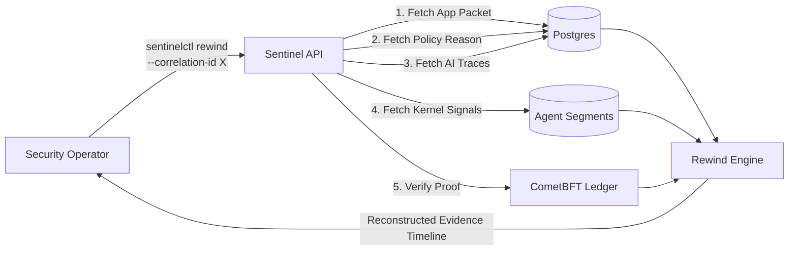

# Sentinel

**A Superior Governance Foundation for Modern Applications**

Sentinel, which is an open-source and fail-safe governance layer, protects your applications. It is elementary that Sentinel ensures that specific critical actions are evaluated against policy, audited, and mathematically anchored to a tamper-proof ledger.

To govern a complete application portfolio from a single control plane, one must integrate Sentinel. It is clear that this system centralises authorisation checks, audit logs, and compliance mechanisms.

## The Merits of Sentinel

To process high-risk transactions (such as issuing refunds, modifying user permissions, or executing agentic AI tool calls), it is imperative that one possesses absolute certainty regarding the identities of actors and their actions.

Sentinel provides the following capabilities:

- **Unified Policy Enforcement**: To enforce policies universally across a stack, one writes them in Rego (OPA).
- **Immutable Evidence**: Sentinel, which anchors high-risk actions to a CometBFT ledger, renders an operational history tamper-evident.
- **Native AI Governance**: To govern AI agents, the system utilises dedicated "AI Lanes", which trace prompt hashes, model choices, and tool invocations.
- **72-Hour Rewind Window**: To reconstruct an incident or a correlation ID with perfect clarity across application events, policy decisions, and runtime kernel evidence, one queries the evidence window.
- **Developer-First Integration**: To integrate systems gracefully, Sentinel supplies drop-in SDKs, minimal overhead, and a "fail-open/fail-closed" mode strategy.

## Architecture

Sentinel, which operates as a decoupled control plane, distinguishes application logic from governance, policy evaluation, and immutable storage.

### High-Level Component Topology



### Authorisation Flow (Guard Mode)

To attempt a high-risk action, an application consults Sentinel. Sentinel, which evaluates the risk, inspects the policy, stores the evidence, and anchors the proof to the ledger.



### Incident Rewind Flow

To investigate an incident, Sentinel correlates data across various persistence layers; it is apparent that this process reconstructs exact events within the 72-hour operational window.



## Rapid Integration

To integrate Sentinel, an engineer adds a middleware or invokes a singular REST call.

### Go SDK Example
```go
import "github.com/your-org/sentinel/sdk/go/sentinel"

client := sentinel.NewClient(sentinel.Config{
    Endpoint: "http://sentinel-api:8080",
    AppID:    "billing-api",
    Mode:     sentinel.ModeGuard, 
})

// Wrap your critical endpoints with Sentinel Middleware
mux.Handle("/refund", client.HTTPMiddleware(
    sentinel.RoutePolicy{
        ActionName: "invoice.refund.create",
        Category:   "http",
        Risk:       "high",
        Mutating:   true,
    },
    refundHandler,
))
```

### Python / AI Integration Example (Claude/Anthropic)

To govern AI models, one must know that specific prompts were dispatched and specific tools were utilised. Sentinel, which handles this effortlessly, provides a robust interface:

```python
decision = sentinel_ai_authorize(
    model_id="claude-3-7-sonnet-20250219", 
    prompt_text=prompt, 
    correlation_id=corr_id
)

if decision.get("decision") == "deny":
    raise PermissionError("AI action prevented by Sentinel.")

# ... execute your Claude API call ...

sentinel_ai_result(
    packet_id=decision["packet_id"], 
    response_text=response_text, 
    tool_call_count=len(tools_used), 
    correlation_id=corr_id
)
```

## Initialisation

To secure an infrastructure, one follows these steps:

1. **Deploy Sentinel**: To run the service locally, one uses Docker Compose; to deploy to Kubernetes, one uses our production-ready Helm charts.
2. **Register Your Application**: To issue identity keys for a service, an administrator uses `sentinelctl`.
3. **Integrate**: To connect systems, a developer drops the SDK into a Go application, a Node.js API, or a Python AI Agent.

To proceed, one consults the Installation Guide and the Integration Runbook.

## Community and Support

Sentinel, which serves developers, prioritises security, compliance, and structural integrity. To contribute, one opens issues, submits PRs, or explores our `/examples` folder (which contains integrations for Go, Express, FastAPI, and Anthropic).
